# Project Description

## 1. Project Overview

- **Project Name:** ICD-10 Code Blue
- **Brief Description:**  
ICD-10 Code Blue is a Python educational game designed to help users practice medical coding under time pressure. In each round, the player reads a symptom-based patient case and submits the best matching ICD-10 code.
  The game supports two workflows: direct code typing and handbook-assisted search. During and after gameplay, the system records performance data and provides statistical visualizations (response time, errors, accuracy, and category trends) so users can monitor improvement over time.
- **Problem Statement:**  
ICD-10 coding is essential for healthcare documentation, but learning it is difficult for beginners. Traditional methods are often passive and do not reflect real decision-making pressure. This project addresses that gap by providing an interactive, timed, feedback-driven training environment.
- **Target Users:**  
  - Medical and nursing students  
  - Clinical coders and health information students  
  - Healthcare workers preparing for coding evaluations  
  - Anyone learning ICD-10 fundamentals
- **Key Features:**  
  - Symptom-based diagnostic coding rounds  
  - Two answer modes: type directly or select from handbook search  
  - Real-time pressure/timer gameplay feedback  
  - Automatic session logging to CSV  
  - Post-game statistics dashboard with multiple chart types
- **Screenshots:**  
  - Game interface: `screenshots/game_ui.png`  
  - Statistics dashboard: `screenshots/stats_ui.png`  
  - Full screenshot folder: [screenshots/](screenshots/)
- **Proposal (PDF):**  
[ICD-10 Code Blue Proposal](./ICD-10_Code_Blue.pdf)
- **YouTube Presentation (~7 minutes):**  
Video link here: `[YouTube Presentation](PASTE_YOUTUBE_LINK)`

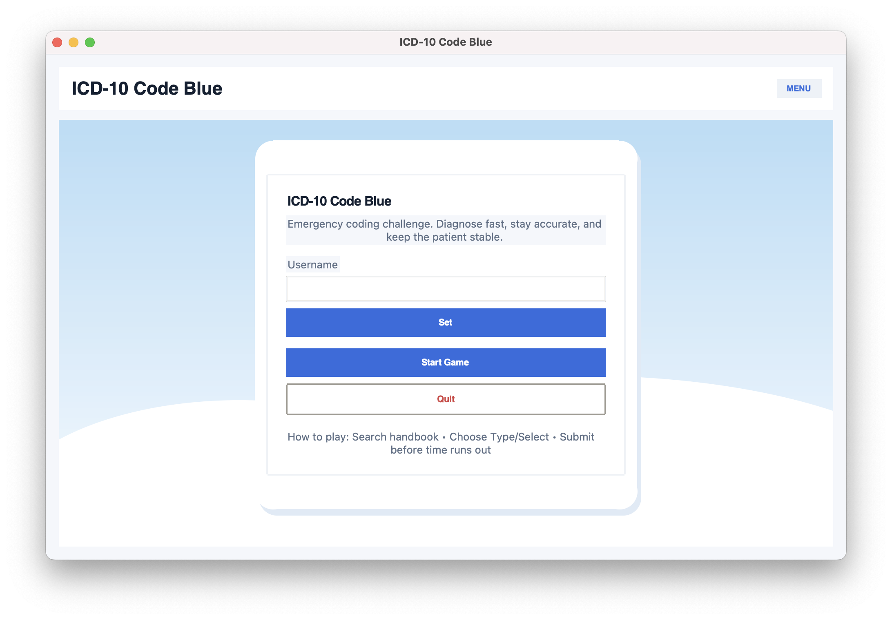 
> [!NOTE]
> The initial screen where users enter their username and start the ICD-10 coding challenge. It provides basic navigation options and a brief overview of the gameplay.

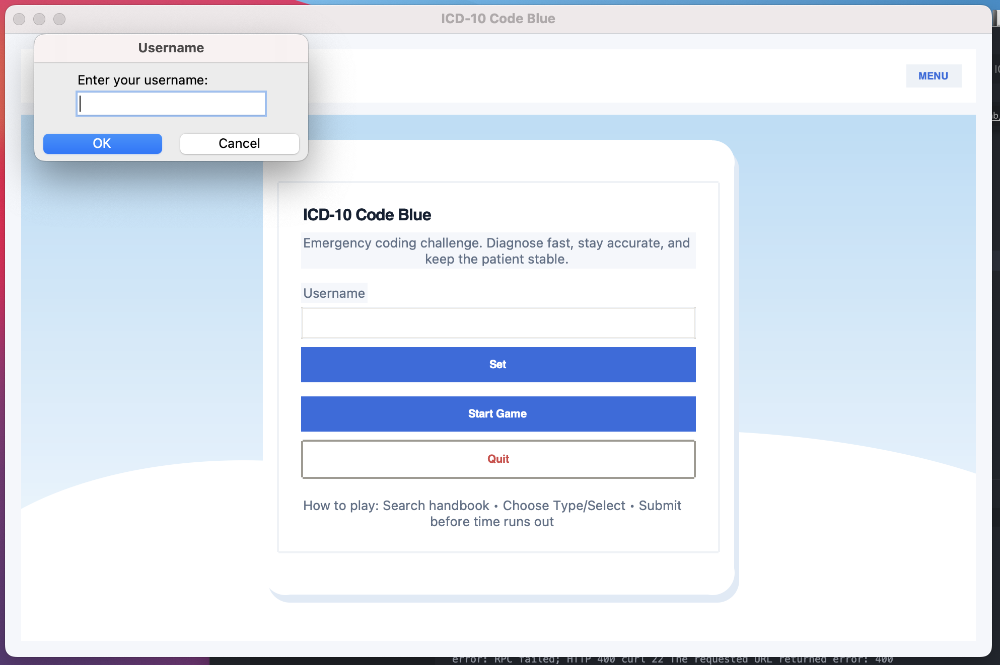 
> [!NOTE]
> If the user clicks the *Start Game* button without entering a username, the system prompts them to input a username before proceeding.

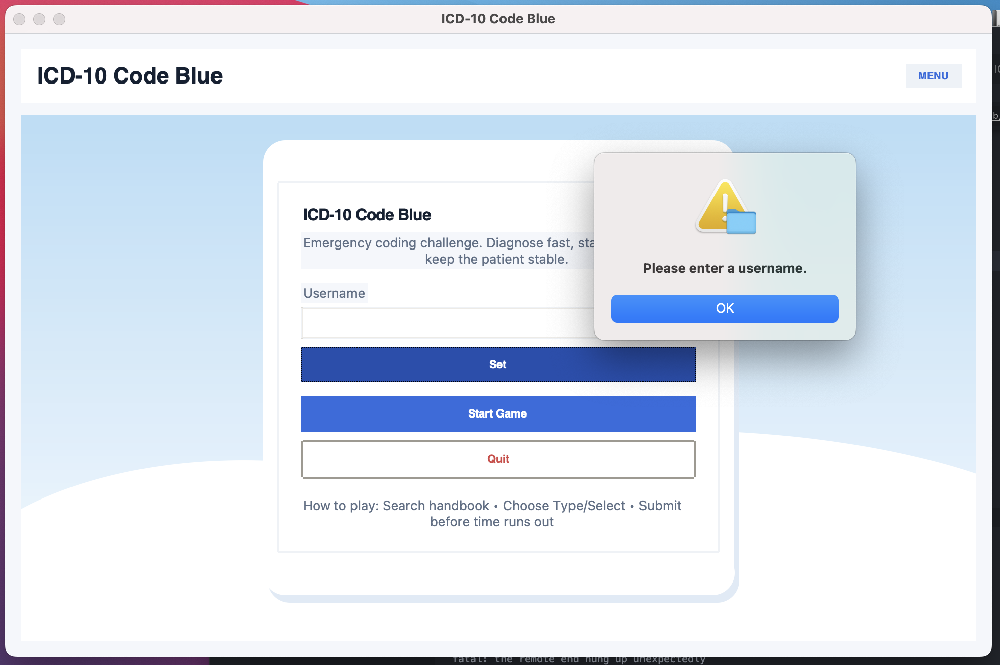 
> [!NOTE]
>  If the user clicks the *Set* button without entering a username, a warning message appears requiring the user to enter a username.

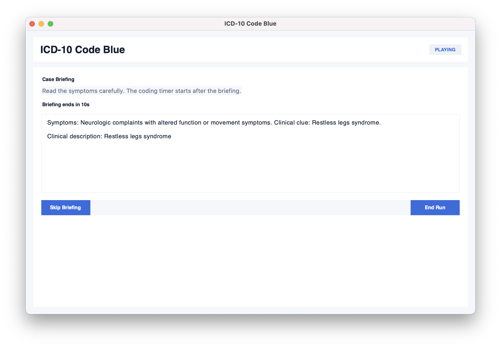 
> [!NOTE]
> A 15-second screen showing patient symptoms, allowing users to review and prepare their diagnosis before gameplay begins.

### Each round has a **30-second time limit**, adding pressure to diagnose quickly and accurately.

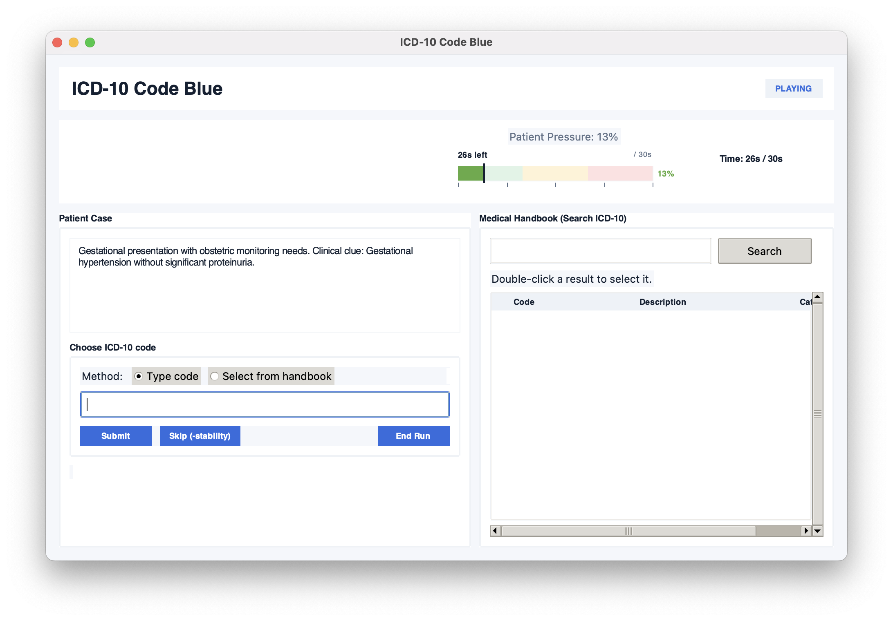 
> [!NOTE]
> The main game interface where users analyze patient cases and submit ICD-10 codes under time pressure, using either direct input or handbook search.

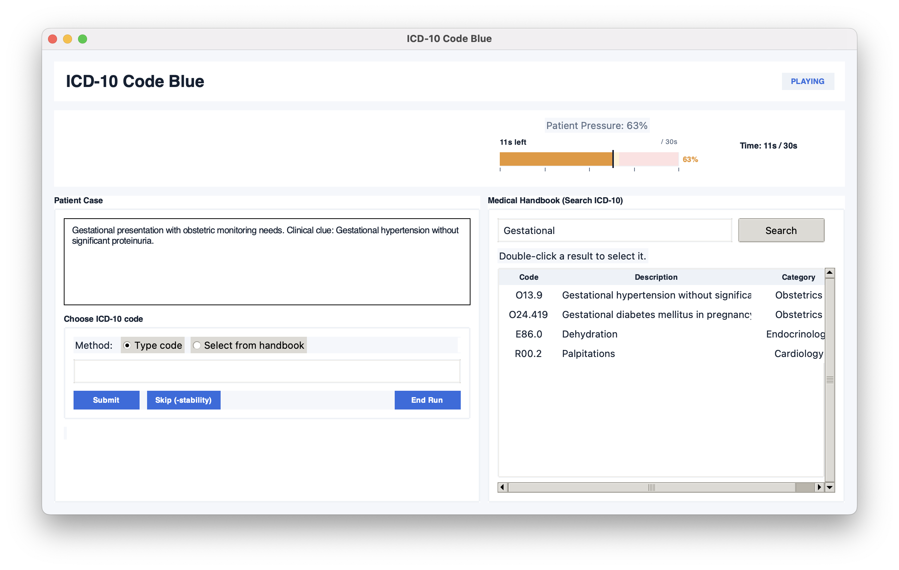 
> [!NOTE]
> Users can search for ICD-10 codes by entering keywords (e.g., “Gestational”) in the medical handbook panel. The system displays a list of matching codes with descriptions and categories. Users can then double-click a result to select the correct code for submission.

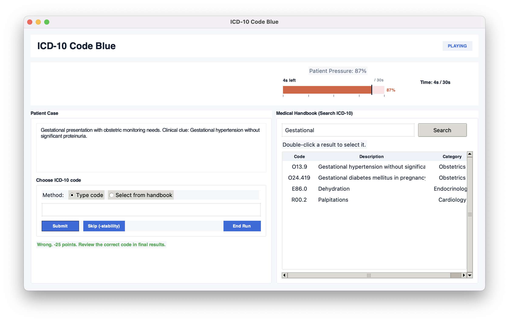 
> [!NOTE]
> When a user submits an incorrect ICD-10 code, a warning message is displayed and points are deducted as a penalty.
---

### Visualization
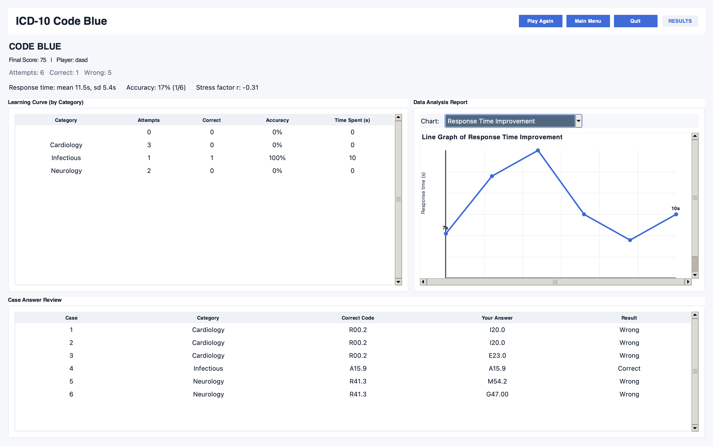 
> [!NOTE]
> A line graph showing how the user’s response time improves across attempts, helping track speed and learning progress over time.

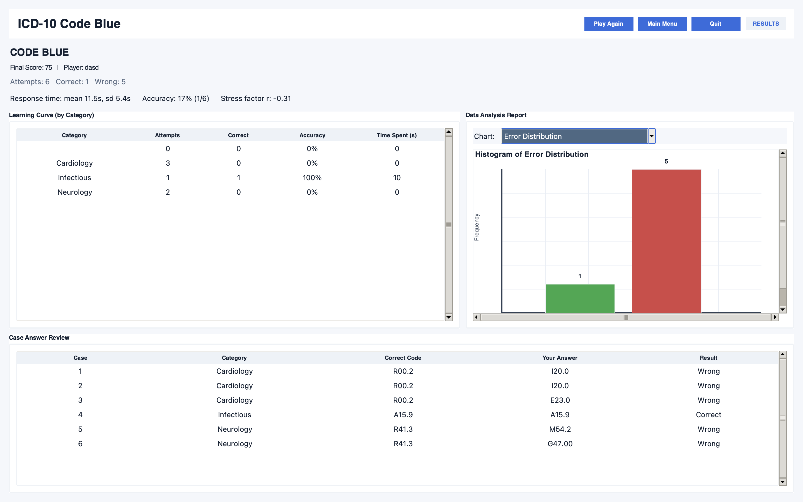 
> [!NOTE]
> A histogram displaying the frequency of incorrect diagnoses, highlighting how often errors occur during gameplay.

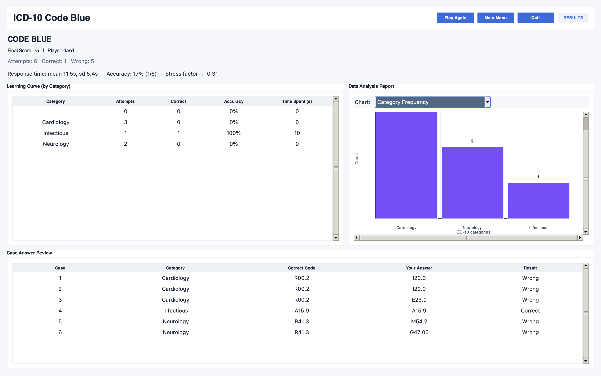 
> [!NOTE]
> A bar chart showing how frequently each ICD-10 category appears, giving insight into case distribution.

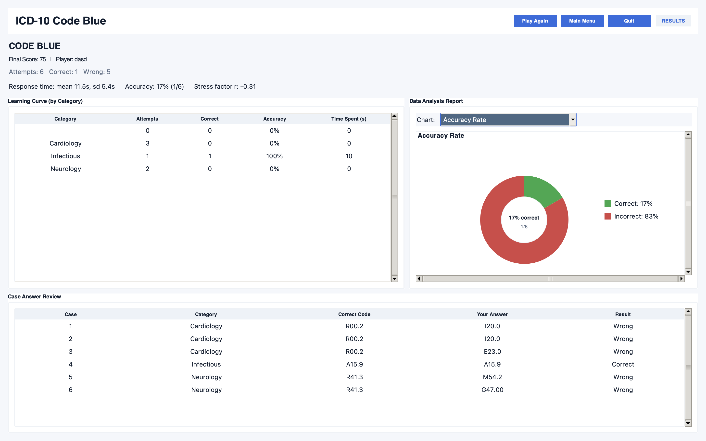 
> [!NOTE]
> A pie chart illustrating the proportion of correct versus incorrect answers, providing an overview of user performance.

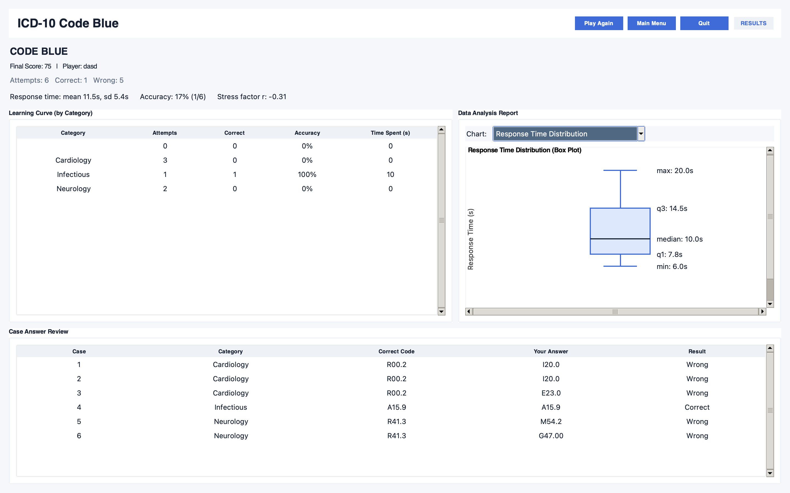 
> [!NOTE]
> A box plot showing the spread and variation of response times across attempts, helping identify consistency and outliers.
---

## 2. Concept

### 2.1 Background

This project started from direct exposure to ICD coding workflows and the difficulty beginners face when searching and selecting accurate codes quickly. Although official references exist, most learning tools are static and do not simulate practical coding pressure.

The motivation was to build a lightweight, interactive training experience that combines diagnosis-style prompts, timed decision-making, and measurable learning outcomes.

### 2.2 Objectives

- Build a gamified ICD-10 learning tool that is practical and engaging  
- Simulate realistic coding decisions using symptom-based cases  
- Support both memorization and lookup workflows through dual input modes  
- Record and visualize player performance for self-evaluation  
- Improve accessibility for self-study outside formal training settings

---

## 3. UML Class Diagram

- UML diagram image (quick view): `[UML](ICD10_Code/UML.png)`  
- UML submission file (required PDF): `docs/UML_Class_Diagram.pdf`

The UML includes:

- Classes  
- Attributes  
- Methods (where applicable)  
- Relationships (association and ownership)

---

## 4. Object-Oriented Programming Implementation

The project is organized into modules with classes that each have a clear responsibility.

### `cases.py`

- `**PatientCase` (dataclass):** Represents one patient challenge with symptom text and the correct ICD-10 code.  
- `**load_cases_csv()` (function):** Loads and validates case data from CSV into `PatientCase` objects.

### `icd_database.py`

- `**ICDEntry` (dataclass):** Represents one ICD record (`code`, `description`, `category`).  
- `**ICD_Database` (class):** Loads ICD data and provides lookup/search utilities, including fuzzy matching support.

### `patient.py`

- `**Patient` (dataclass):** Represents the currently active patient shown in gameplay.  
- `**template_symptoms_for_category()` (function):** Provides fallback symptom templates by category.

### `controller.py`

- `**GameConfig` (dataclass):** Central configuration for timing, scoring, and gameplay tuning.  
- `**GameState` (enum):** Defines game screens/states (`MENU`, `PLAYING`, `GAME_OVER`).  
- `**GameController` (class):** Core game engine handling case flow, timer rules, scoring, submissions, skip behavior, and game-over logic.

### `stats.py`

- `**AttemptRecord` (dataclass):** Stores one gameplay event with timestamps and performance values.  
- `**CategoryStats` (dataclass):** Tracks per-category totals and derived accuracy.  
- `**StatsTracker` (class):** Handles logging, aggregation, summary generation, and CSV export.

### `ui.py`

- `**UIStrings` (dataclass):** Stores user-facing labels/title text.  
- `**Palette` (dataclass):** Defines color tokens used by the interface.  
- `**UI_Manager` (class):** Builds and controls Tkinter screens (menu, briefing/gameplay, result dashboard), plus chart rendering and interactions.

### Class Relationship Summary

```text
run_app() -> UI_Manager
UI_Manager -> GameController
UI_Manager -> StatsTracker
UI_Manager -> ICD_Database (search)
GameController -> GameConfig
GameController -> ICD_Database
GameController -> StatsTracker
GameController -> Patient (active case)
load_cases_csv() -> PatientCase -> GameController.load_cases()
StatsTracker -> AttemptRecord, CategoryStats
```

---

## 5. Statistical Data

### 5.1 Data Recording Method

For each relevant event (case start, submit, skip, game over), the system records:

- timestamp  
- case code/category  
- entered answer  
- correctness  
- response time  
- time remaining  
- stability  
- score

Data is written to:

- per-session CSV file in `data/game_logs/`
- cumulative global CSV log for historical analysis

### 5.2 Data Features

The dashboard provides five analysis views:

1. **Response Time Improvement** (Line Chart)
  - X: attempt sequence  
  - Y: response time (seconds)
2. **Error Distribution** (Histogram/Bar)
  - X: result class (correct/incorrect)  
  - Y: frequency
3. **Category Frequency** (Bar Chart)
  - X: ICD category  
  - Y: number of occurrences
4. **Accuracy Rate** (Pie Chart)
  - Correct vs incorrect ratio
5. **Response Time Distribution** (Box Plot)
  - Spread of response time values across attempts

---

## 6. Changed Proposed Features (Optional)

- Gameplay timing was adjusted during implementation for better usability:
  - each new case starts with a fresh timer
  - wrong submissions apply direct time penalty
  - pressure gauge visuals were improved for readability

---

## 7. External Sources

### Data Source

- World Health Organization (WHO), ICD reference materials  
[https://www.who.int/classifications/icd/en/](https://www.who.int/classifications/icd/en/)

### Libraries / Frameworks


| Library       | Usage                       | License               |
| ------------- | --------------------------- | --------------------- |
| `tkinter`     | GUI and widgets             | Python built-in (PSF) |
| `csv`         | CSV read/write logging      | Python built-in (PSF) |
| `pathlib`     | File path handling          | Python built-in (PSF) |
| `dataclasses` | Data container classes      | Python built-in (PSF) |
| `enum`        | Game state enum             | Python built-in (PSF) |
| `datetime`    | Timestamp handling          | Python built-in (PSF) |
| `math`        | Numeric/statistical helpers | Python built-in (PSF) |


